### Escuela Colombiana de Ingeniería
### Arquitecturas de Software - ARSW

## Miembros:

* Andres Felipe Calderon Ramirez
* Jose David Castillo

## Escalamiento en Azure con Maquinas Virtuales, Sacale Sets y Service Plans

### Dependencias
* Cree una cuenta gratuita dentro de Azure. Para hacerlo puede guiarse de esta [documentación](https://azure.microsoft.com/es-es/free/students/). Al hacerlo usted contará con $100 USD para gastar durante 12 meses.
Antes de iniciar con el laboratorio, revise la siguiente documentación sobre las [Azure Functions](https://www.c-sharpcorner.com/article/an-overview-of-azure-functions/)

### Parte 0 - Entendiendo el escenario de calidad

Adjunto a este laboratorio usted podrá encontrar una aplicación totalmente desarrollada que tiene como objetivo calcular el enésimo valor de la secuencia de Fibonnaci.

**Escalabilidad**
Cuando un conjunto de usuarios consulta un enésimo número (superior a 1000000) de la secuencia de Fibonacci de forma concurrente y el sistema se encuentra bajo condiciones normales de operación, todas las peticiones deben ser respondidas y el consumo de CPU del sistema no puede superar el 70%.

### Escalabilidad Serverless (Functions)

1. Cree una Function App tal cual como se muestra en las  imagenes.


Se busca la Aiplicacion de funciones:

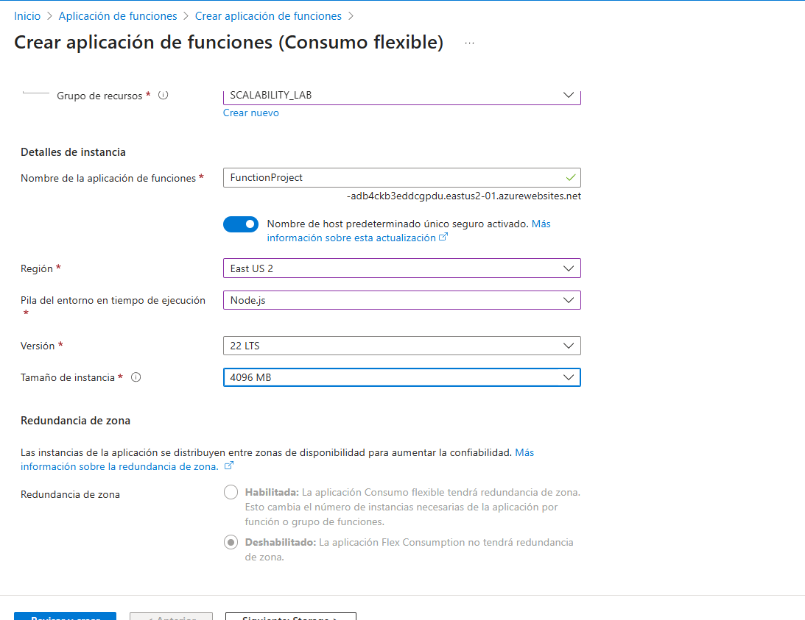

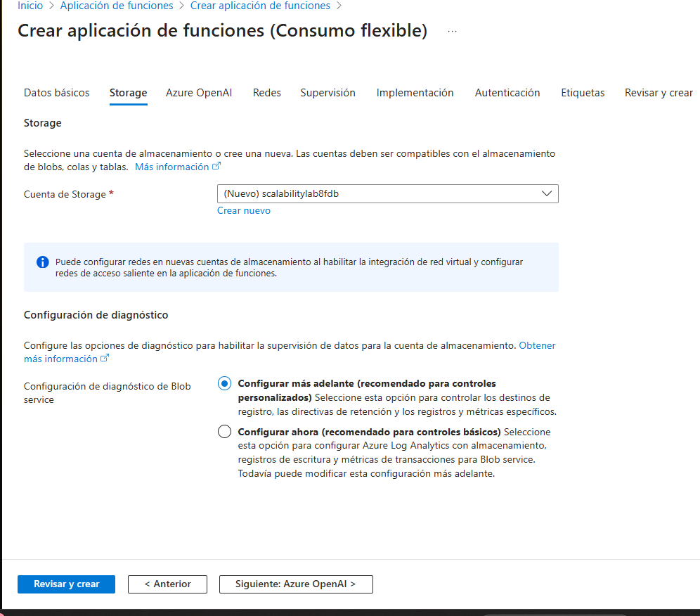


2. Instale la extensión de **Azure Functions** para Visual Studio Code.


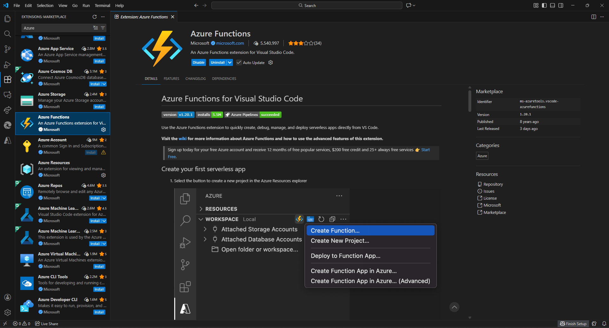

3. Despliegue la Function de Fibonacci a Azure usando Visual Studio Code. La primera vez que lo haga se le va a pedir autenticarse, siga las instrucciones.


Abrimos el proyecto en visual studio:

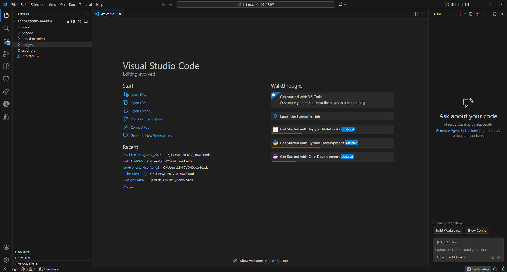

Iniciamos sesion en azure desde el visual studio

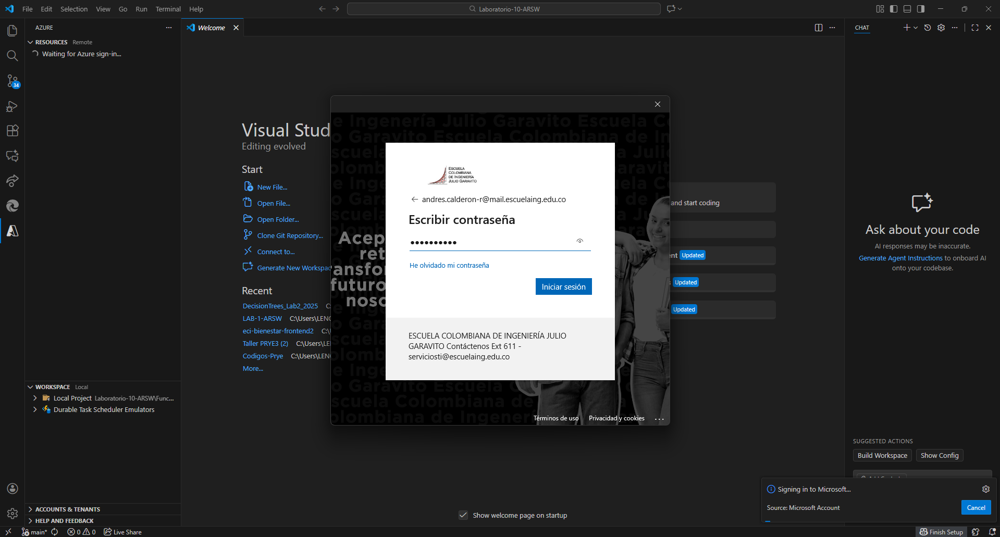

Buscamos el directorio del proyecto y ahi le damos click derecho y buscamos la opcion para desplegar en la function app.

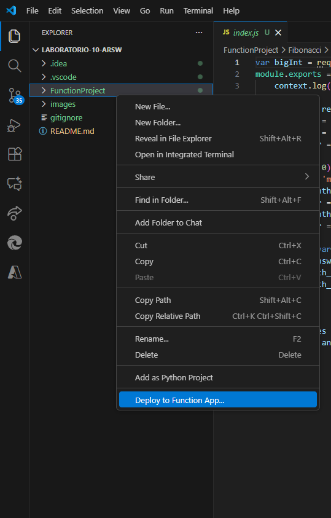

Seleccionamos la function app que creamos en azure portal:

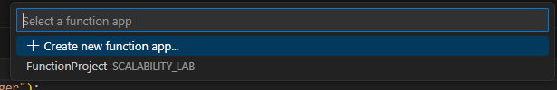

Ya se habra desplegado:

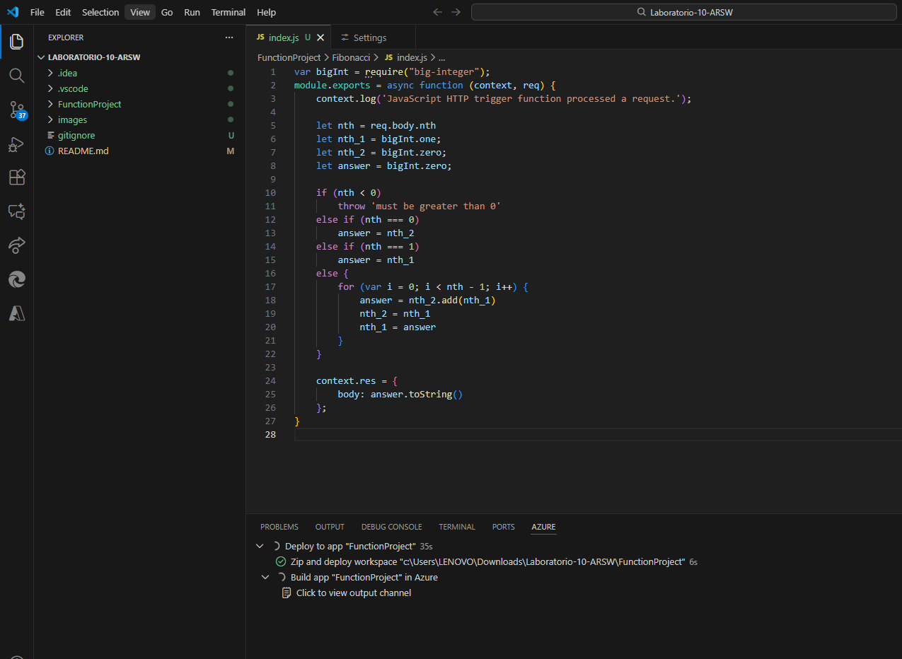

4. Dirijase al portal de Azure y pruebe la function.


Entramos en el function project de azure portal y buscamos nuestra funcion:

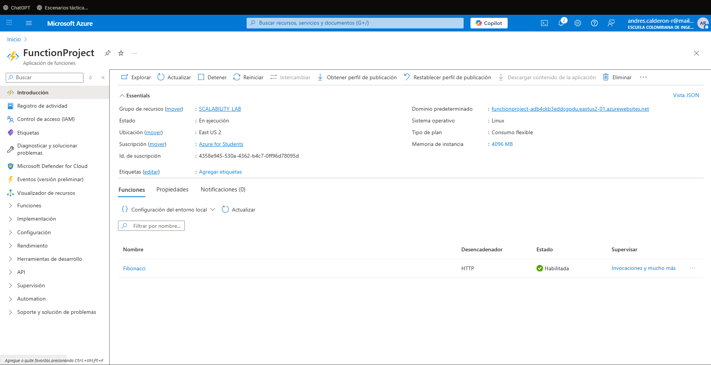

Entramos:

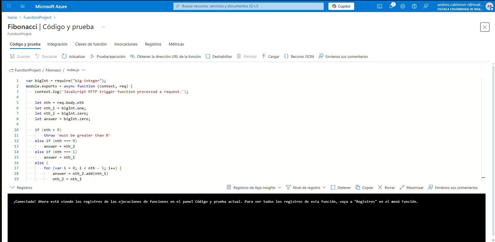

Y probamos:

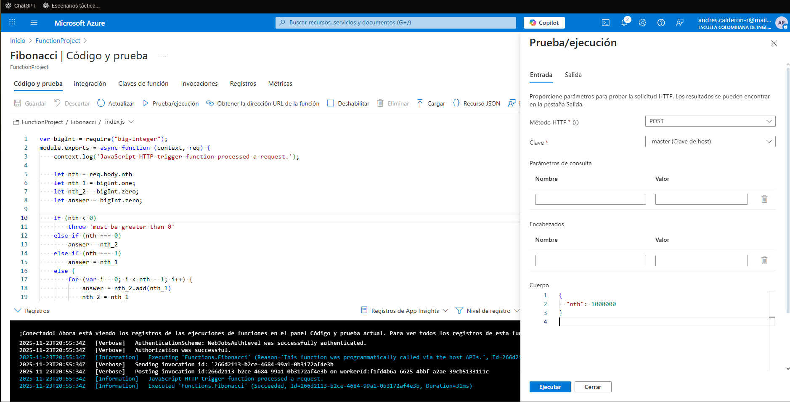

Solucion:

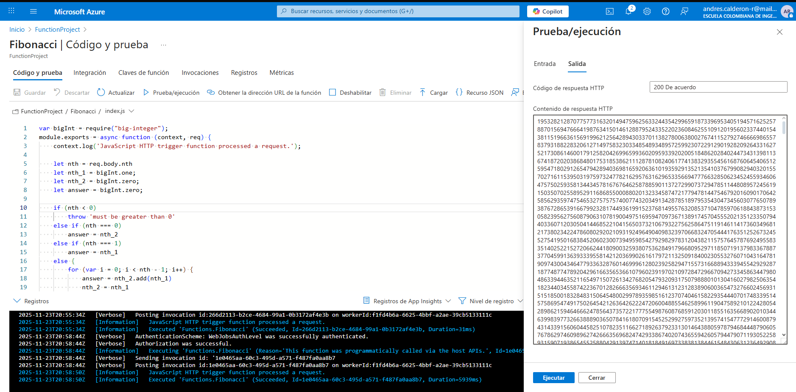

5. Modifique la coleción de POSTMAN con NEWMAN de tal forma que pueda enviar 10 peticiones concurrentes. Verifique los resultados y presente un informe.

Esto se hizo a travez del comando "newman run collection.fibnacci.json" y para la concurrencia "newman run collection.fibnacci.json -n 10"


6. Cree una nueva Function que resuleva el problema de Fibonacci pero esta vez utilice un enfoque recursivo con memoization. Pruebe la función varias veces, después no haga nada por al menos 5 minutos. Pruebe la función de nuevo con los valores anteriores. ¿Cuál es el comportamiento?.

Esto se hizo cambiando el index y redesplegando

```
module.exports = async function (context, req) {
    context.log('JavaScript HTTP trigger function processed a request.');

    const nth = req.body.nth;

    if (nth < 0) {
        return context.res = {
            status: 400,
            body: "nth debe ser >= 0"
        };
    }

    const memo = {};

    function fib(n) {
        if (memo[n] !== undefined) return memo[n];
        if (n === 0) return 0;
        if (n === 1) return 1;

        memo[n] = fib(n - 1) + fib(n - 2);
        return memo[n];
    }

    const result = fib(nth);

    context.res = {
        body: result.toString()
    };
};
```

Valores primera prueba


Valores despues de 5 minutos


**Preguntas**

* ¿Qué es un Azure Function?

Es una solucion sin servidor que permite escribir menos codigo, amentener menos infraestructura y ahorrar costos.
Proporciona varios recursos actualizados para mantener las aplicaciones en ejecucion, asi uno solo se preocupa con el
codigo y su lenguaje y el Azure Function se va a encargar del resto.

* ¿Qué es serverless?

Significa sin servidor, es una solucion que permite crear y ejecutar aplicaciones con rapidez y menor costo
total de propiedad, ya que no es necesario aprovisionar y administrar infraestructura.

Con esto nos dejamos de preocupar por el gasto de recursos, administracion de servidores y sistemas operativos
y nos preocupamos solo por el codigo de la aplicacion.

* ¿Qué es el runtime y que implica seleccionarlo al momento de crear el Function App?

Es el entorno de ejecucion que da los servicios y recursos necesarios para ejecutar el codigo.
El runtime se encarga de determinar el lenguaje de progranacion, version y entorno en el quue se ejecutaa el codigo.

* ¿Por qué es necesario crear un Storage Account de la mano de un Function App?

Es necesario para el almacenamiento de archivos de la aplicación, los disparadores y enlaces, el escalado y durabilidad y los registros de ejecuciones de funciones

* ¿Cuáles son los tipos de planes para un Function App?, ¿En qué se diferencias?, mencione ventajas y desventajas de cada uno de ellos.


| Plan            | Escalabilidad | Pago          | Cold Start | Uso recomendado                |
| --------------- | ------------- | ------------- | ---------- | ------------------------------ |
| **Consumption** | Automática    | Por ejecución | Sí         | Tráfico variable, barato       |
| **Premium**     | Automática    | Por instancia | No         | Apps críticas, cargas pesadas  |
| **Dedicated**   | Manual        | Mensual fijo  | No         | Apps existentes en App Service |


* ¿Por qué la memoization falla o no funciona de forma correcta?

Las Azure Functions son stateless. Esto significa:

La variable memo = {} solo existe durante la ejecución, cuando termina la ejecución, se pierde en memoria.

Por esto mismo no recuerda resultados anteriores.

* ¿Cómo funciona el sistema de facturación de las Function App?

Esto depende del plan:

| Plan            | ¿Cuándo pagas?                  | ¿Cobro por ejecución? |
| --------------- | ------------------------------- | --------------------- |
| **Consumption** | Solo cuando usas                | Sí                    |
| **Premium**     | Por instancias reservadas + uso | Sí                    |
| **Dedicated**   | Pago mensual fijo               | No                    |
